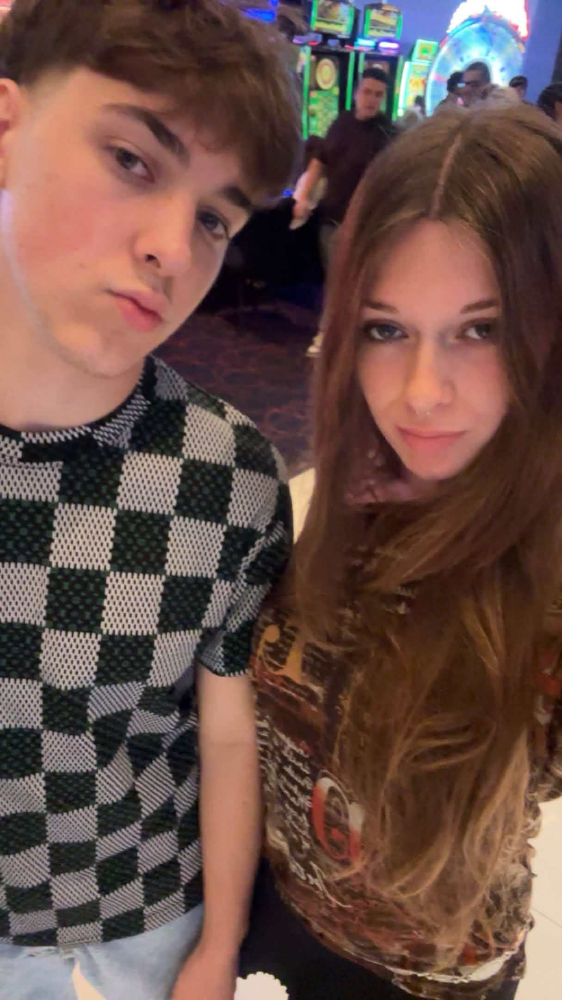
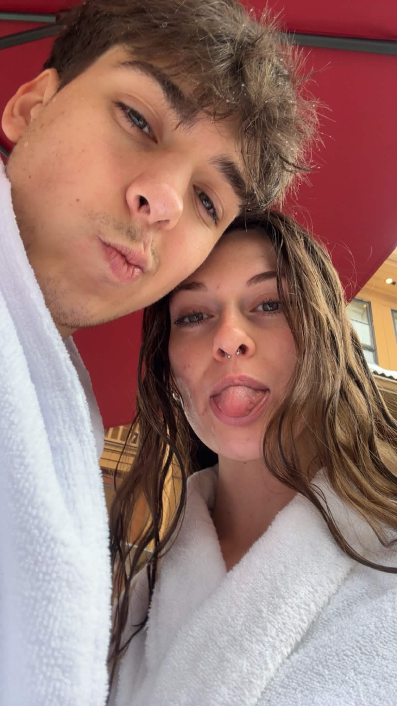

<!DOCTYPE html>
<html>
<head>
<meta name="viewport" content="width=device-width, initial-scale=1.0">
<title>For My Valentine ❤️</title>

</head>

<body>

<!-- PAGE 1 -->

    
    

    <button onclick="showPage2()">Next ❤️</button>

<!-- PAGE 2 -->

    <h2>Will you be my Valentine? ❤️</h2>

    <button onclick="sayYes()">Yes 💖</button>
    <button onclick="sayNo()">No</button>

    

    

</body>
</html>
